# OpenVPN 运维控制台

面向个人、团队和小型企业的 OpenVPN 统一运维管理台。它将账号、客户端、证书、连接、流量、审计、防火墙、通知与 AI 运维集中到一个控制台，并提供适合电视墙、会议室与值班场景的 **运营大屏**。

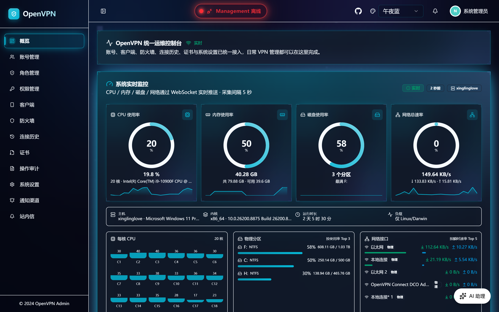

> **快速入口**：登录后访问 [`/screen`](#运营大屏screen) 进入全屏运营看板；常规运维入口为 [`/overview`](#运维总览)。

---

## 目录

- [核心亮点](#核心亮点)
- [运营大屏（/screen）](#运营大屏screen)
- [网站访问审计（可选）](#网站访问审计可选)
- [功能矩阵](#功能矩阵)
- [AI 智能运维助手](#ai-智能运维助手)
- [页面速览](#页面速览)
- [系统架构](#系统架构)
- [技术栈](#技术栈)
- [快速启动](#快速启动)
- [本地开发](#本地开发)
- [数据库配置](#数据库配置)
- [构建打包与发布](#构建打包)
- [项目结构](#项目结构)
- [文档](#文档)

---

## 核心亮点

- **全链路 OpenVPN 运维**：账号、客户端 `.ovpn`、CCD、证书与 CRL、防火墙、通知、连接历史、流量统计和操作审计在一个控制台闭环管理。
- **运营大屏**：`/screen` 以全屏 Bento Grid 汇聚核心指标、在线连接、流量排行、服务健康、风险提示和动态地理态势，适合实时值守与运营展示。
- **交互式地理态势**：可切换“在线客户端来源 / 管理操作来源 / 网站目标服务”，支持全球可旋转地球、中国省级地图、数量标记与去重公网 IP 明细查看。
- **AI 智能运维助手**：基于 Google ADK 与外部 OpenAI 兼容模型，当前内置 **27 项受 RBAC 约束的工具能力**；既能查询，也能在受控范围内执行常规运维与诊断修复。
- **安全的故障处理**：客户端连接诊断、OpenVPN Server 配置与管理通道诊断、受限修复、配置备份、重载与复检；不会把任意 Shell、路径、证书或私钥内容交给模型执行。
- **可选网络审计**：支持 DNS 域名审计与 Suricata EVE 元数据审计；界面、导出、连接历史关联和 AI 查询均沿用既有权限与数据范围。
- **细粒度权限与安全登录**：内置管理员/审计员/普通用户角色与按钮级权限码，支持 MFA、会话控制、多主题与审计追踪。
- **多形态交付**：Docker 多架构镜像、Web-only 多平台压缩包，以及 Linux 完整 Server 安装包；前端产物通过 `go:embed` 进入单体服务。

---

## 运营大屏（/screen）

`/screen` 是面向运营与值班场景的全屏看板。进入浏览器全屏后，常规侧边栏、顶部导航和 AI 悬浮入口会隐藏，只保留运营信息；普通页面模式下仍可使用完整管理菜单。

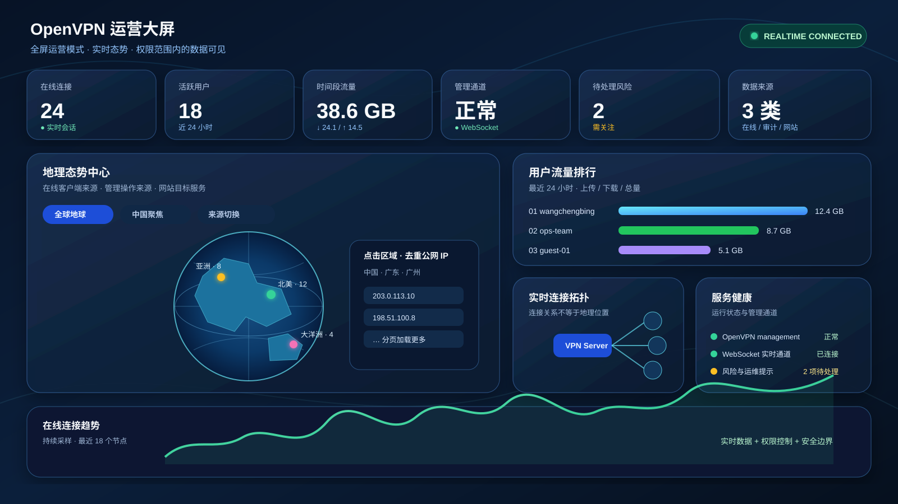

> 上图为功能导览示意，实际大屏会随着在线连接、连接历史、审计与权限范围实时变化。

### 一屏看到什么

| 区域 | 展示内容 | 数据更新/交互 |
|------|----------|---------------|
| **核心指标** | 在线连接、用户与客户端规模、当日/时间段流量、OpenVPN 管理通道状态 | WebSocket 推送 + 定时快照刷新 |
| **用户流量排行** | 选定时间段内每位活跃用户的上传、下载与总流量 | 按用户聚合，便于定位高流量账号 |
| **地理态势中心** | 全球地球 / 中国地图、区域数量、来源切换、未知区域提示 | 可拖拽旋转、缩放、悬停与点击查看详情 |
| **实时连接拓扑** | OpenVPN Server 与当前在线客户端关系 | 仅表达连接关系，不将其误认为地理位置 |
| **服务健康与风险** | Management、运行信息、监听地址、实时通道，以及账号/证书/防火墙/服务风险 | 风险仅展示与引导，不在看板中直接执行危险操作 |
| **在线趋势与摘要** | 最近在线连接趋势、实时会话数、活跃用户、待处理提示 | 支持浏览器全屏切换 |

### 地理态势：交互、来源与边界

- **全球视图**：交互式 3D 地球默认展示国家名称；支持旋转、缩放，点位显示该区域的去重公网 IP 数量。
- **中国聚焦**：展示中国省级行政区、名称、悬浮信息和区域数量；点击省份或点位可继续查看明细。
- **三类来源**：
  - **在线客户端来源**：来自 OpenVPN management 当前在线会话的公网来源地址；
  - **管理操作来源**：来自后台操作审计日志的访问来源；
  - **网站目标服务**：来自可选网络审计观察到的目标 IP，**表示目标服务所在地，不代表 VPN 用户所在地**。
- **IP 明细受控**：点击区域后可以分页查看对应的**去重公网 IP**；后端按当前用户的细粒度权限和可见用户范围过滤，未授权来源不会返回明细。
- **隐私与精度**：可视化基于 GeoIP 的国家/省/市聚合，不宣称定位精度高于数据源；私网、VPN 内网地址和无法解析的地址不会被当作公网地理点展示。

### 大屏数据流

```mermaid
flowchart LR
  O[OpenVPN management
在线会话] --> G[地理聚合与连接拓扑]
  H[连接历史
时间段流量] --> T[用户流量排行]
  A[操作审计] --> G
  W[网站访问审计
可选] --> G
  S[服务状态与风险] --> R[服务健康 / 风险提示]
  G --> D[/screen 运营大屏]
  T --> D
  R --> D
```

---

## 网站访问审计（可选）

网站访问审计默认关闭，可按部署需求启用 DNS 域名审计和/或 Suricata EVE 元数据采集。以下说明聚焦 Suricata EVE 采集链路。

网络审计默认关闭。镜像内置 Suricata，但只有 `system.base.suricata_eve_enabled=true` 时，采集控制进程才会等待 OpenVPN 创建 `tun0`，再以 IDS 模式在同一容器、NAT 前监听该接口。Compose 已声明所需的最小能力 `NET_RAW`（并保留 OpenVPN 所需的 `NET_ADMIN`）；不使用 `privileged`、host network、IPS、PCAP、payload 或规则下载。启用后 EVE JSONL 固定写入持久化路径 `/data/suricata/eve.json`，可通过 `docker compose logs -f openvpn` 查看采集控制进程和 Suricata 日志。关闭开关后，控制进程会终止 Suricata 子进程并保留已有 EVE 与已导入记录；Suricata 子进程异常退出时，控制进程会尝试重新启动它；控制进程自身退出时才由 Supervisor 重启。两类故障均不会中断 OpenVPN 或 Web 服务。

首次启用前请确认 VPN 网关模式已创建 `tun0`，并让配置中的 `suricata_eve_path` 保持默认 `/data/suricata/eve.json`。在 `/data/config.json` 中保存以下配置即可开启，应用与控制进程会检测配置变化：

```json
{
  "system": {
    "base": {
      "suricata_eve_enabled": true,
      "suricata_eve_path": "/data/suricata/eve.json"
    }
  }
}
```

使用 `docker compose exec openvpn supervisorctl status suricata-audit` 检查控制进程，使用 `docker compose exec openvpn test -f /data/suricata/eve.json` 检查 EVE 文件。可用 `suricata_eve_poll_seconds` 调整导入轮询，`suricata_eve_max_days` 控制留存（未设置时回退 `history_max_days`）。导入器可在文件缩小后从头读取；对于同大小且前缀相同的原子替换轮转，当前版本不能可靠识别，建议保留 `eve.json` 当前文件并使用 copytruncate 或在维护窗口重启导入服务。

导入器只保存已关联 VPN 用户的 `flow`、`dns`、`tls`、`http`、`alert` 事件中的网络元数据，例如五元组、流量计数、DNS 名称、TLS SNI/版本、HTTP 主机、**不含 query/fragment 的路径**、方法及告警信息。它不会保存完整 EVE JSON、HTTP 请求或响应正文、Cookie、Authorization、URL 参数或任何 payload；HTTPS 仍仅提供可见的 TLS 元数据。查询、导出和状态接口复用 `web-audit:view` 权限及既有用户/分组数据范围。

---

## 功能矩阵

| 模块 | 能力 | 入口 / 展示 |
|------|------|-------------|
| **运营大屏** | 全屏运营模式、核心指标、用户流量排行、服务健康、在线趋势、风险提示、实时拓扑 | [`/screen`](#运营大屏screen) / [功能导览](doc/screenshots/operations-screen-overview.svg) |
| **地理态势** | 全球交互地球、中国省级地图、在线/审计/网站目标三类来源、区域数量、去重公网 IP 明细分页 | 大屏地理态势中心 |
| **账号与分组** | 创建/修改/删除账号、批量导入导出、有效期、固定 IP、MFA、角色绑定、密码重置、多级分组 | [Users](doc/screenshots/users.png) / [Roles](doc/screenshots/roles.png) |
| **客户端配置** | 生成/下载 `.ovpn`、CCD 路由推送、客户端生命周期、断开在线连接、客户端连接诊断 | [Clients](doc/screenshots/clients.png) |
| **连接与流量** | 上线/下线历史、IP 归属地、时间段内按用户上传/下载流量、趋势与访问记录关联 | [History](doc/screenshots/history.png) |
| **证书管理** | CA / 服务端 / 客户端证书、CRL、续签、过期预警、单个或批量清理遗留客户端证书 | [Certs](doc/screenshots/certs.png) |
| **防火墙** | nftables 黑名单、上下行带宽限速（QoS）、按 IP / 用户 / 用户组维度管理 | [Firewall](doc/screenshots/firewall.png) |
| **网站访问审计（可选）** | DNS 域名、TLS/HTTP/flow/alert 元数据、筛选、导出、连接历史联查与可见范围控制 | 系统菜单「网站访问审计」 |
| **操作审计** | 创建/更新/删除/登录等管理行为追踪，按操作人/模块/动作/时间筛选并导出 | [Audit](doc/screenshots/audit.png) |
| **通知体系** | 通知收件箱、未读实时推送；钉钉、企微、Webhook、Email、Discord、Slack、Telegram、Mattermost 等渠道 | [Notifications](doc/screenshots/notifications.png) / [Channels](doc/screenshots/channels.png) |
| **系统与 AI** | OpenVPN 参数、LDAP、客户端安装包、外部 LLM 配置；自然语言查询、诊断与受控修复 | [Settings](doc/screenshots/settings.png) / [AI Assistant](doc/screenshots/ai-assistant.png) |

---

## AI 智能运维助手

内置 Google ADK Agent 与外部大模型的对话式运维助手。AI 不是绕过权限的超级管理员：每次工具调用都会关联当前登录操作者，并复用系统的 RBAC 权限和可见数据范围。当前代码注册 **27 项工具能力**，覆盖查询、日常运维、审计分析、连接诊断和受控自愈。

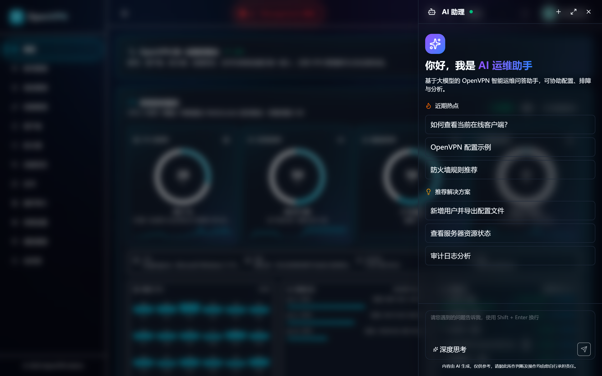

### 支持的 LLM Provider

- **DeepSeek**：使用 DeepSeek API；模型、接口地址与密钥通过管理端持久化配置。
- **OpenAI**：使用 OpenAI 兼容接口。
- **Customize**：接入任意外部 OpenAI-compatible 服务。

> 镜像不会初始化、下载或运行内置本地模型。容器化部署时请填写从应用容器网络可达的外部 API 地址；敏感 API Key 以加密形式持久化，并在界面中脱敏展示和复制。

### 27 项工具能力一览

| 范围 | 工具 | 能力 |
|------|------|------|
| **账号与权限（8）** | `create_user`、`list_users`、`update_user`、`delete_user`、`bind_role`、`reset_password`、`reset_mfa`、`get_system_counts` | 账号与角色管理、密码/MFA 处理、基础统计 |
| **客户端与连接（8）** | `generate_client`、`regenerate_client`、`list_clients`、`delete_client`、`update_ccd`、`list_online_clients`、`kill_connection`、`diagnose_client_connection` | 配置生成、CCD、在线会话、断开连接与故障诊断 |
| **防火墙（2）** | `list_firewall_rules`、`manage_firewall` | 查询黑名单/限速并执行受权限限制的增删改 |
| **证书（1）** | `list_certs` | 查询 PKI 元数据与状态；AI 不提供绕过保护删除系统证书的能力 |
| **OpenVPN 健康与修复（4）** | `diagnose_openvpn_server`、`repair_openvpn_server`、`get_dashboard`、`get_server_resources` | Server 配置/管理通道诊断、受控修复、运营摘要与资源快照 |
| **通知（2）** | `list_channels`、`manage_channel` | 查询、创建、更新、删除或测试通知渠道（均受权限限制） |
| **审计与网站访问（2）** | `query_audit_logs`、`get_website_access_stats` | 管理审计检索、DNS 域名审计统计与近期记录 |

### 诊断与受限自愈

当客户端无法连接或 OpenVPN Server 异常时，AI 可先收集**证书、配置、运行状态、管理通道、连接信号**并给出排查结论。服务端修复不是任意命令执行：

1. 仅接受后端预定义的修复动作（恢复受应用管理的 PKI 指令、修复 `crl-verify` 引用、或安全重载）；不接受模型传入的 Shell、文件路径、证书或私钥内容。
2. 修复前检查 CA、服务端证书/私钥、CRL、`tls-crypt` 等必需 PKI 文件；缺失时拒绝改写配置。
3. 不改写有效的自定义 PKI 路径，也不自动重写端口、协议、网段或 management 配置。
4. 以原子方式写入 `server.conf` 备份，发送重载信号后重新诊断；未通过复检会保留备份并报告失败。

### 使用示例


```
👤 你：帮我创建一个测试用户 test001，邮箱 test@example.com
🤖 AI：好的，正在创建用户...
       ✅ 已创建用户 test001，自动生成 .ovpn 客户端配置
       ✅ 开通邮件已发送至 test@example.com

👤 你：查看当前在线连接有哪些？
🤖 AI：当前在线连接 0 个：
       （无活跃连接）

👤 你：把所有超过 30 天没上线的用户禁用
🤖 AI：查询到 5 个用户超过 30 天未登录，是否全部禁用？
       [即将执行：update_user * 5]
```

### AI 工具与页面操作的完全对齐

`create_user` 工具复用了页面 "新增用户" 的完整流程：
1. 创建用户记录（含姓名、邮箱、有效期、固定 IP）
2. 自动生成 OpenVPN 客户端 .ovpn 配置文件
3. 异步发送开通通知邮件（包含初始密码 + .ovpn 附件 + 安装包下载链接）

所有工具均通过 `agent.ToolContext.UserID()` 获取当前操作者身份并执行 RBAC 权限校验。

---

## 页面速览

### 登录页

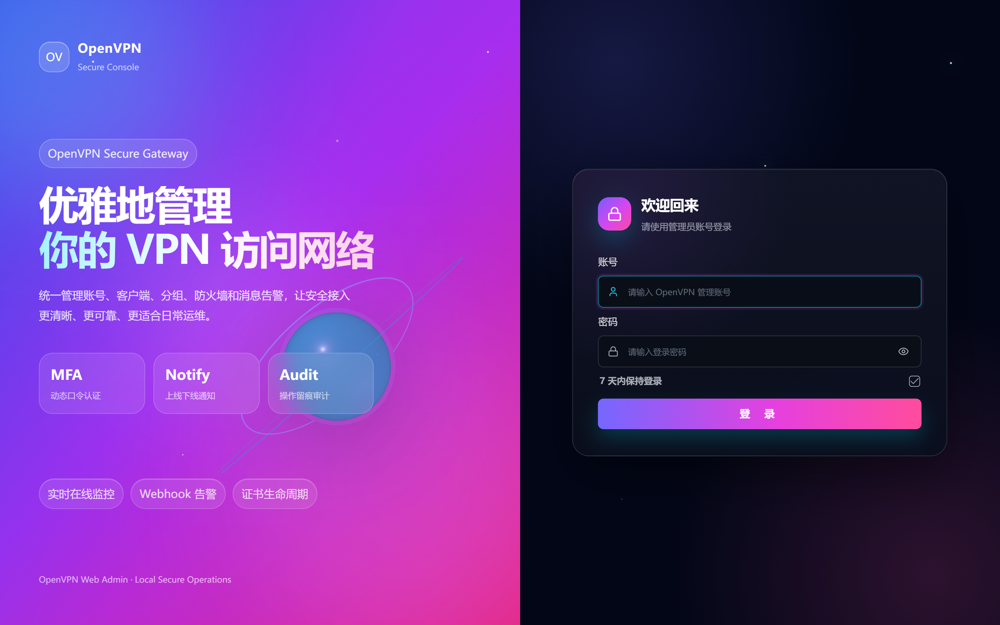

- 支持账号密码 + MFA 双因素认证
- 首次登录强制修改密码
- 7 天免登录（受控选项）

### 运维总览


- 实时系统监控（CPU/内存/磁盘/网络）通过 WebSocket 推送，采集间隔 5 秒
- 服务器基本信息（主机名、内核、运行时间、负载）
- 每核 CPU 使用率、物理分区、网络接口流量 Top N

### 运营大屏


- 路由：`/screen`；支持浏览器全屏模式，进入全屏时仅保留运营看板
- Bento Grid 布局汇集核心指标、用户流量排行、实时连接拓扑、服务健康、在线趋势和风险提示
- 地理态势支持全球地球与中国省级地图，切换在线客户端/管理操作/网站目标三种数据来源
- 点击区域查看去重公网 IP 明细；明细查询按 RBAC、数据范围与来源权限过滤

### 网站访问审计（可选）

- DNS 域名事件提供访问域名、活跃用户、唯一域名、TOP 域名与用户排行、状态与可能漏报原因
- 可按用户和时间筛选、分页浏览与导出；连接历史可联查对应时间段的访问记录
- HTTPS 不解密；仅处理可观测元数据，不记录网页正文、Cookie、Authorization 或 URL 查询参数

### 账号管理

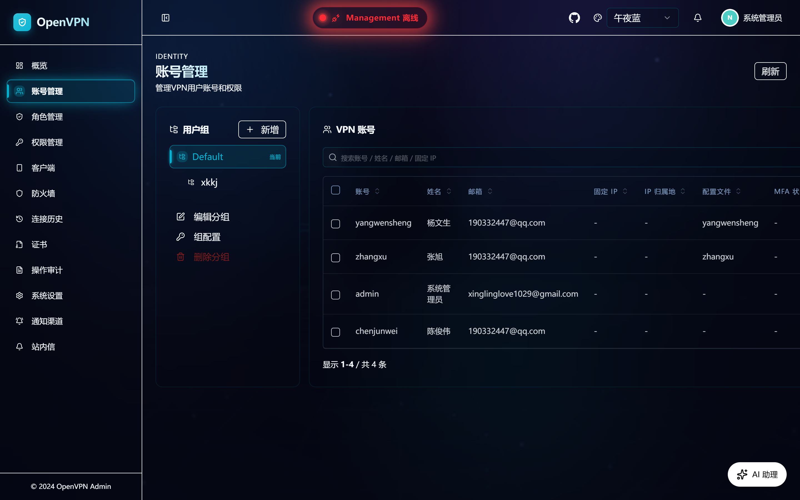

- 用户组 + 账号两级管理
- 搜索/排序/分页/批量操作
- 单个用户操作：编辑、配置、删除、修改密码、生成客户端、下载 .ovpn、CCD 设置、修改 MFA

### 客户端配置

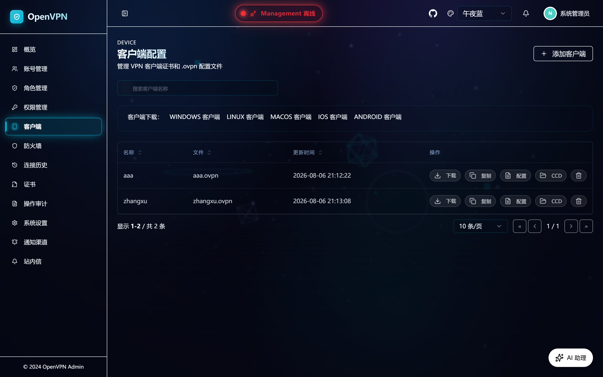

- 按客户端证书文件管理
- 多平台客户端下载（WINDOWS / LINUX / MACOS / IOS / ANDROID）
- 单个 .ovpn 操作：下载、复制内容、配置、CCD、删除

### 证书管理

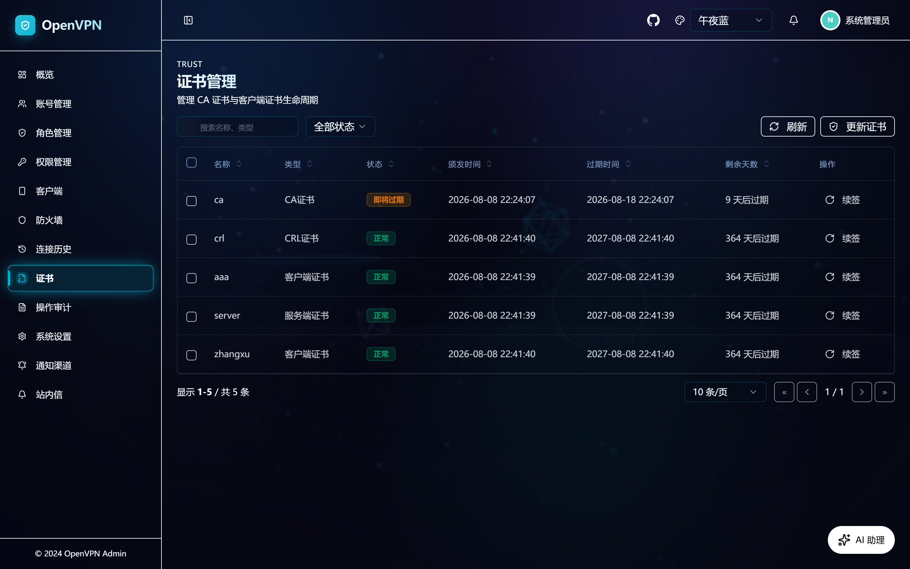

- CA / 服务端 / 客户端证书分类，CRL 状态与即将过期提醒
- 客户端遗留证书支持单个或批量清理；CA、服务端证书与 CRL 明确受保护，不可删除
- 一键续签，删除与续签均有操作反馈与权限校验

### 操作审计

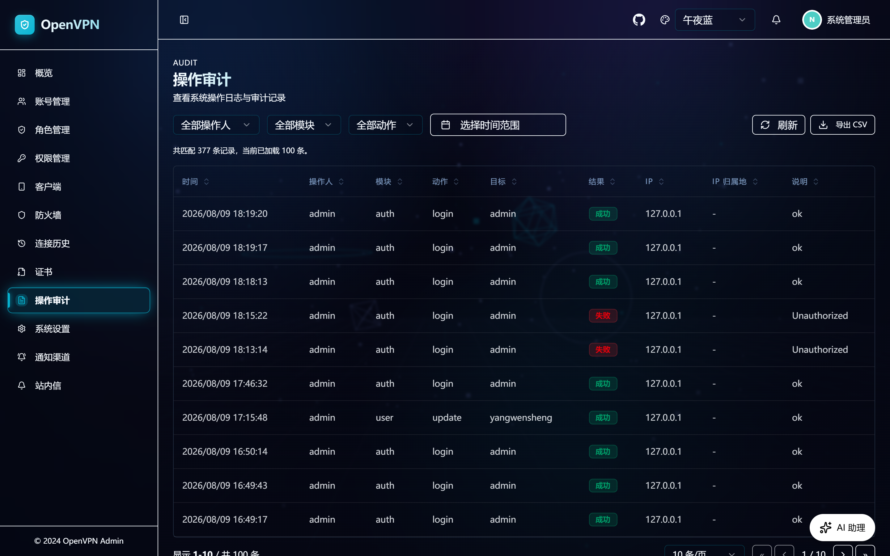

- 全量操作日志（创建/更新/删除/登录/登出 等）
- 多维度筛选（操作人/模块/动作/时间范围）
- CSV 导出

### 角色管理

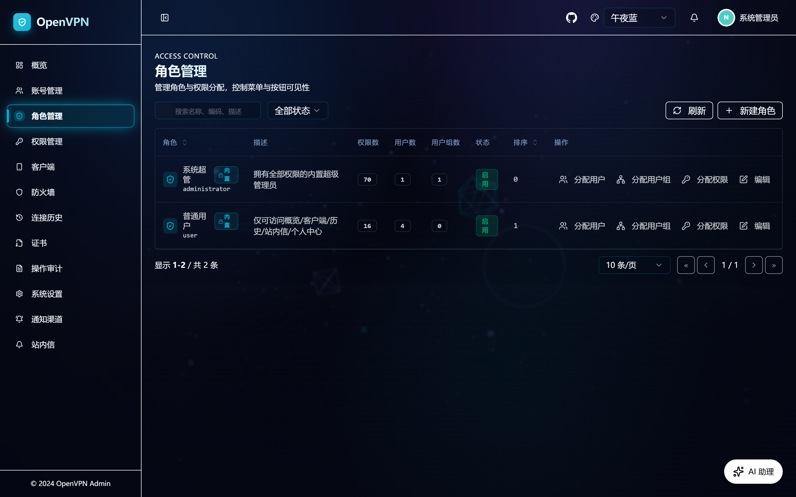

- RBAC 角色定义
- 角色权限分配（按钮级权限码）
- 角色用户绑定

### 防火墙

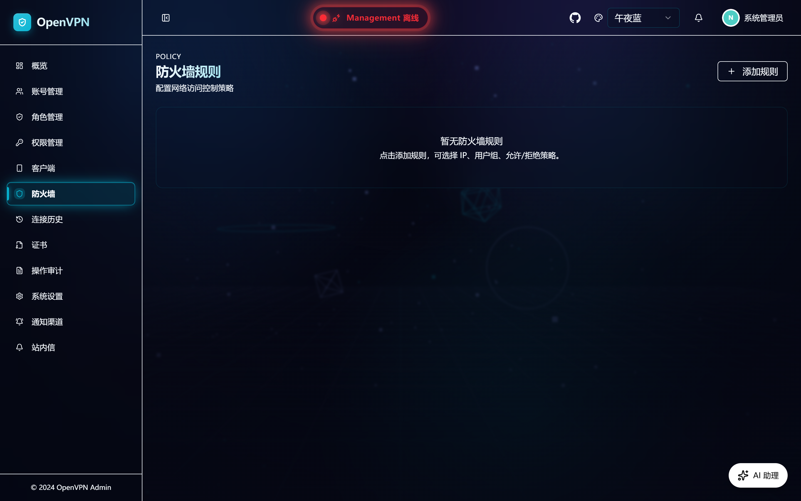

- 基于 nftables 的黑名单 + 限速规则
- 支持按 IP / 用户 / 用户组维度
- 上下行带宽独立限速

### 通知中心

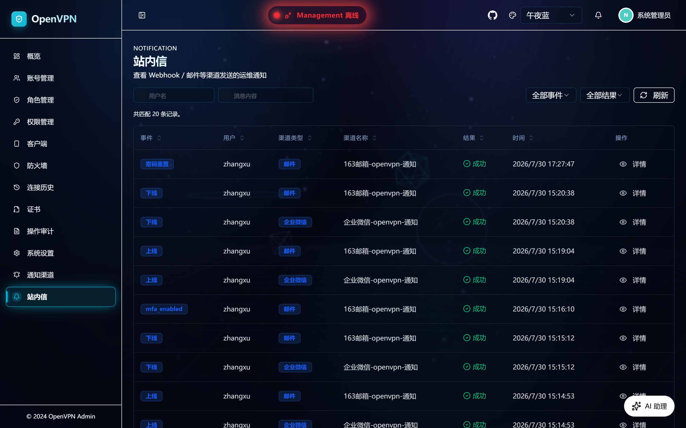

- 系统通知收件箱
- 未读计数实时刷新
- WebSocket 推送

### 通知渠道

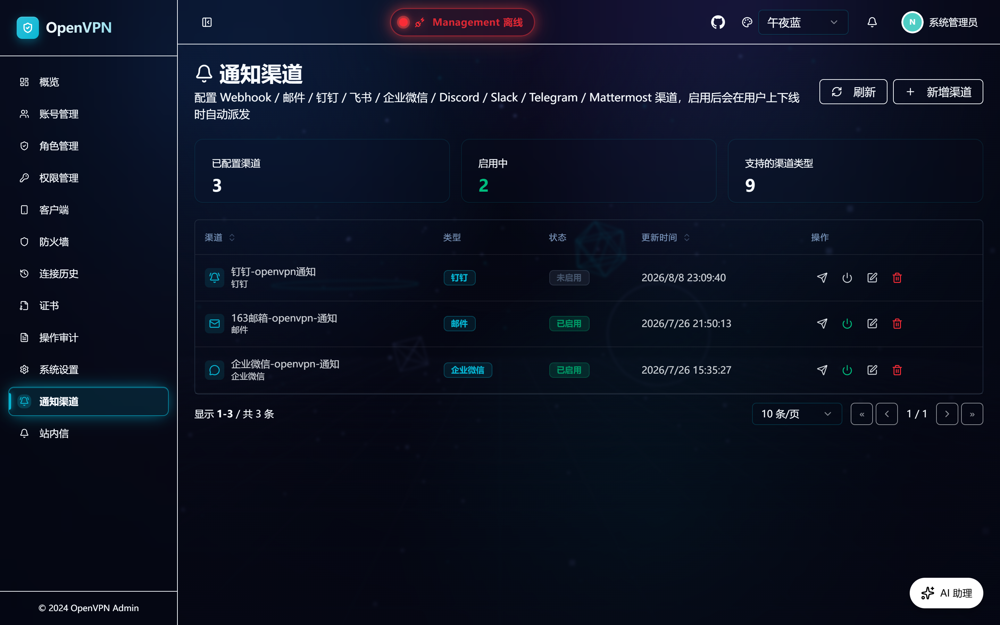

- 9 种渠道支持：钉钉/企业微信/Webhook/Email/Discord/Slack/Telegram/Mattermost/通用
- 每种渠道独立测试按钮
- 失败重试记录

### 系统设置

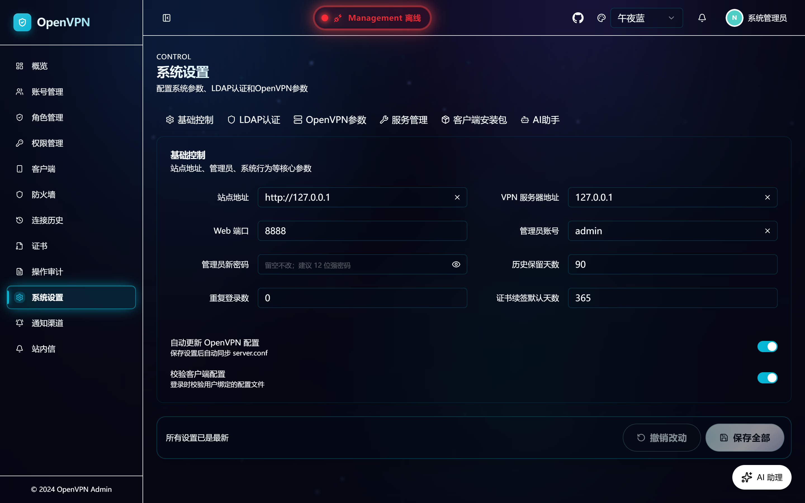

- 基础设置（站点名、Logo、注册开关）
- LDAP 集成
- OpenVPN 服务端参数（子网、DNS、协议、加密算法）
- 客户端安装包管理（上传/启用/下载）
- AI 助手配置（Provider/Model/API Key/System Prompt）

### 连接历史

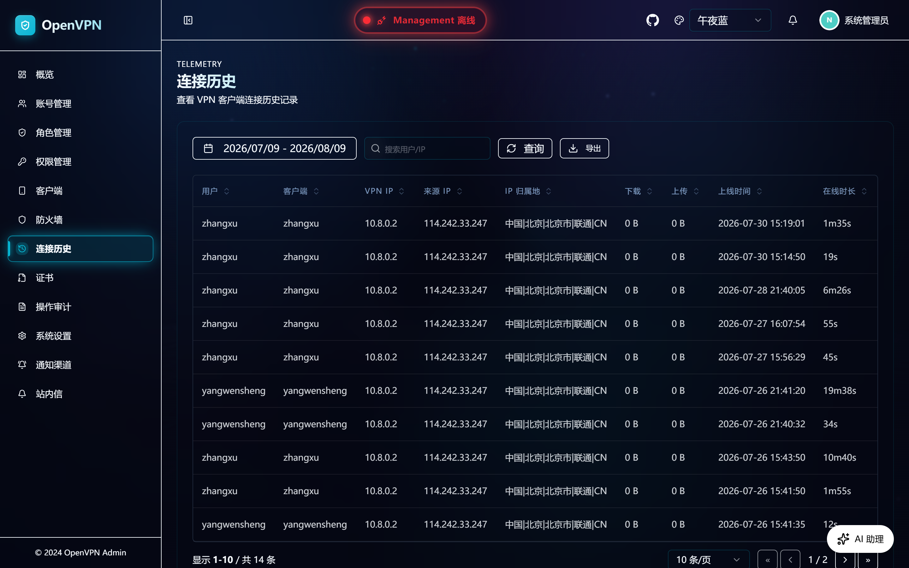

- 上线/下线历史、客户端与公网 IP 归属地
- 在指定时间段内按用户统计上传、下载和总流量，并支持图表展示
- 可联查对应连接时间段内的可见网站访问审计记录

---

## 系统架构

```
┌─────────────────────────────────────────────────────────────────┐
│                      Browser (Chrome/Edge)                       │
└──────────────────────────────┬──────────────────────────────────┘
                               │ HTTP/SSE/WebSocket
                               ▼
┌─────────────────────────────────────────────────────────────────┐
│                  openvpn-web (Single Binary)                     │
│  ┌──────────────────────┐    ┌──────────────────────────────┐    │
│  │  Gin HTTP Router     │───▶│  React SPA (embedded via     │    │
│  │  /login /admin /ovpn │    │  go:embed index.html)        │    │
│  └──────────┬───────────┘    └──────────────────────────────┘    │
│             │                                                    │
│  ┌──────────▼─────────────────────────────────────────────────┐  │
│  │          GORM (SQLite / MySQL / PostgreSQL)               │  │
│  └──────────┬─────────────────────────────────────────────────┘  │
│             │                                                    │
│  ┌──────────▼──────────┐    ┌──────────────────────────────┐    │
│  │  OpenVPN PKI        │    │  nftables / supervisor        │    │
│  │  (Easy-RSA)         │    │  (firewall + hooks)          │    │
│  └─────────────────────┘    └──────────────────────────────┘    │
│                                                                  │
│  ┌──────────────────────────────────────────────────────────┐    │
│  │   AI Agent Layer (Google ADK v1.5.1)                     │    │
│  │   ┌─────────────┐  ┌─────────────┐  ┌────────────────┐   │    │
│  │   │ ChatSession │  │ AgentRunner │  │ ToolService    │   │    │
│  │   │ Manager     │──│ (functiontool│──│ (27 tools)     │   │    │
│  │   │             │  │  loop)     │  │                │   │    │
│  │   └─────────────┘  └──────┬──────┘  └────────────────┘   │    │
│  └────────────────────────────┼─────────────────────────────┘    │
│                               │                                  │
└───────────────────────────────┼──────────────────────────────────┘
                                ▼
                ┌──────────────────────────────┐
                │  LLM Backend                 │
                │  (DeepSeek / OpenAI-compatible) │
                └──────────────────────────────┘
```

### 后端分层

```
cmd/openvpn-web/                 # 启动入口（main.go）
└── internal/openvpnweb/
    ├── server.go                # Gin 路由 + RBAC 中间件
    ├── config.go                # Viper 配置
    ├── user.go                  # User 模型 + AES 加密/解密
    ├── client.go                # 客户端 .ovpn 生成
    ├── ccd.go                   # CCD 路由配置
    ├── pki.go                   # Easy-RSA 证书管理
    ├── firewall.go              # nftables 封装
    ├── audit.go                 # 操作审计
    ├── dashboard.go             # 概览与运营数据汇总
    ├── dashboard_geo.go         # 大屏地理来源聚合与 IP 明细分页
    ├── web_audit*.go            # DNS / Suricata 网站访问审计
    ├── openvpn_repair.go        # Server 自检与受控修复
    ├── channel.go               # 通知渠道
    ├── ai/
    │   ├── agent.go             # ADK Agent 初始化
    │   ├── tools.go             # 27 项 function tool 注册
    │   ├── sse.go               # SSE 流式响应
    │   └── llm.go               # 外部 OpenAI-compatible 客户端
    ├── ai_tool_service.go       # AI 工具的 RBAC 业务实现
    └── templates/               # Go embed 模板
        └── index.html           # React 宿主页
```

### 前端分层

```
frontend/src/
├── api.ts                       # HTTP 请求封装与统一错误处理
├── App.tsx                      # 路由
├── layout/
│   ├── Layout.tsx               # 整体布局（含 AIWidget 挂载）
│   └── Sidebar.tsx              # RBAC 动态菜单
├── pages/
│   ├── Overview/                # 常规运维总览
│   ├── ExecutiveDashboard/      # 全屏运营大屏
│   ├── Users/                   # 账号管理
│   ├── Clients/                 # 客户端配置
│   ├── Firewall/                # 防火墙
│   ├── History/                 # 连接历史
│   ├── Certs/                   # 证书管理
│   ├── Audit/                   # 操作审计
│   ├── WebAudit/                # 网站访问审计（可选）
│   ├── Settings/                # 系统设置（含 AI 配置）
│   ├── Notifications/           # 通知中心
│   ├── ChannelProviders/        # 通知渠道
│   ├── Roles/                   # 角色管理
│   ├── Permissions/             # 权限管理
│   ├── Profile/                 # 个人中心
│   ├── Login/                   # 登录页
│   ├── Download/                # 客户端下载页（公开）
│   └── AIAssistant/             # AI 助手独立页面
├── components/
│   ├── AIWidget/                # 全局悬浮 AI 入口
│   ├── ExecutiveDashboard/      # 地球、中国地图、拓扑与大屏卡片
│   ├── HeroOrbitScene/          # 登录页 3D 动效
│   ├── MarkdownContent/         # Markdown 渲染（AI 回复用）
│   └── ... UI 组件库
├── store/
│   ├── auth.tsx                 # 登录态 + 用户信息
│   ├── theme.tsx                # 4 套主题切换
│   └── systemStatus.tsx         # 系统实时状态
└── lib/
    ├── sse.ts                   # 统一 SSE 解析器
    └── notificationHub.ts       # WebSocket 客户端
```

---

## 技术栈

### 后端

| 类别 | 选型 |
|------|------|
| 语言 | Go 1.25.4 |
| Web 框架 | Gin v1.11.0 |
| ORM | GORM v1.31.1 |
| 数据库 | SQLite (glebarez/sqlite 驱动) |
| AI 框架 | Google ADK v1.5.1 |
| LLM 客户端 | DeepSeek / OpenAI-compatible |
| 证书 | Easy-RSA + crypto/x509 |
| 防火墙 | nftables |
| 配置 | Viper v1.21.0 |
| 会话 | gin-contrib/sessions + gorilla/sessions |
| WebSocket | gorilla/websocket |
| MFA | pquerna/otp（TOTP） |
| LDAP | go-ldap/ldap/v3 |
| 邮件 | wneessen/go-mail |
| 加密 | AES (自实现敏感字段加密) + bcrypt (密码) |
| 定时任务 | robfig/cron/v3 |
| 监控 | gopsutil/v3 |
| IP 归属地 | lionsoul2014/ip2region |

### 前端

| 类别 | 选型 |
|------|------|
| 框架 | React 19 + TypeScript |
| 构建 | Vite |
| 路由 | React Router 7 |
| 样式 | Tailwind CSS 4 + CSS Variables |
| UI 基础 | Radix UI + 自研组件（shadcn/ui 设计语言） |
| 地图 / 3D | Three.js（交互式全球地球）+ SVG 中国地图 |
| 图标 | lucide-react |
| 日期 | date-fns + react-day-picker |
| Markdown 渲染 | react-markdown + remark-gfm |
| 通知 | sonner |
| 包管理 | pnpm |

### 部署

| 类别 | 选型 |
|------|------|
| 镜像 | Debian bookworm-slim（OpenVPN/Web 运行时） |
| 进程管理 | supervisor |
| VPN | OpenVPN 2.6 |
| 防火墙 | nftables |
| 多架构 | linux/amd64, linux/arm64, linux/arm/v7 |

---

## 快速启动

### Docker Compose（推荐）

```bash
git clone https://github.com/xinglinglove1029/openvpn
cd openvpn
docker compose up -d --build
docker compose logs -f
```

启动后访问：

```text
http://127.0.0.1:8888/login       # 管理员登录
http://127.0.0.1:8888/download    # 客户端下载（公开页）
```

默认管理员账号：

```text
用户名：admin
密码：admin
```

> **生产环境首次登录后请立即修改默认管理员密码。**

停止服务：

```bash
docker compose down
```

### Docker Run

```bash
docker run -d \
  --name openvpn \
  --cap-add=NET_ADMIN \
  --cap-add=NET_RAW \
  -p 1194:1194/udp \
  -p 8888:8888 \
  -e ADMIN_USERNAME=admin \
  -e ADMIN_PASSWORD=admin \
  -v $(pwd)/data:/data \
  xinglinglove1029/openvpn:latest
```

---

## 本地开发

### 1. 前端构建

```bash
cd frontend
npm install          # 或 pnpm install
npm run build        # 输出到 internal/openvpnweb/templates/static/admin/
```

### 2. 启动后端

```bash
# Linux/macOS
mkdir -p ./data
export OVPN_DATA=$(pwd)/data
go run ./cmd/openvpn-web

# Windows PowerShell
New-Item -ItemType Directory -Force .\data
$env:OVPN_DATA = (Resolve-Path .\data).Path
go run .\cmd\openvpn-web
```

### 3. 前端热更新（开发模式）

```bash
cd frontend
npm run dev          # 启动 Vite dev server (默认 http://127.0.0.1:5173)
```

修改 `frontend` 后必须重新执行 `npm run build`，并重启 Go 服务或重新打包二进制。
Go 使用 `go:embed` 嵌入静态资源，仅刷新浏览器不会更新已嵌入的前端资源。

---

## 数据库配置

默认使用 SQLite（`$OVPN_DATA/ovpn.db`），零配置即可运行；也可通过 `$OVPN_DATA/config.json` 的 `database` 节点切换为 MySQL 或 PostgreSQL。

```jsonc
{
  "database": {
    "type": "sqlite",              // sqlite | mysql | postgres，默认 sqlite
    "host": "127.0.0.1",
    "port": 0,                     // 0 表示按类型取默认（mysql:3306 / postgres:5432）
    "user": "root",
    "password": "",
    "name": "openvpn-web",         // mysql/postgres 数据库名
    "path": "ovpn.db",             // sqlite 文件路径（相对 OVPN_DATA 或绝对路径）
    "charset": "utf8mb4",          // mysql 字符集
    "ssl_mode": "disable",         // postgres sslmode：disable | require | verify-ca | verify-full
    "max_open_conns": 0,
    "max_idle_conns": 0,
    "conn_max_lifetime_seconds": 0
  }
}
```

> `type`、`path`、`host`、`port` 等键缺省时均有内置默认值；`type` 缺省或为空即 SQLite，老部署无需修改任何配置。

### MySQL 示例

```json
{
  "database": {
    "type": "mysql",
    "host": "127.0.0.1",
    "port": 3306,
    "user": "openvpn",
    "password": "your-password",
    "name": "openvpn-web",
    "charset": "utf8mb4",
    "max_open_conns": 20,
    "max_idle_conns": 5
  }
}
```

需要先创建数据库：`CREATE DATABASE IF NOT EXISTS openvpn-web CHARACTER SET utf8mb4 COLLATE utf8mb4_unicode_ci;`

### PostgreSQL 示例

```json
{
  "database": {
    "type": "postgres",
    "host": "127.0.0.1",
    "port": 5432,
    "user": "openvpn",
    "password": "your-password",
    "name": "openvpn-web",
    "ssl_mode": "disable"
  }
}
```

需要先创建数据库：`CREATE DATABASE "openvpn-web";`

### 注意事项

- 应用启动时会自动建表（GORM AutoMigrate）并写入种子数据（角色/权限/默认管理员），MySQL/PostgreSQL 需确保账号有建表权限。
- 用户/分组等递归查询使用 `WITH RECURSIVE`：MySQL 需 8.0 及以上，PostgreSQL 需 8.4 及以上（现代版本均满足）。
- 切换数据库类型不会自动迁移旧数据；如需从 SQLite 迁出，请自行使用数据库迁移工具或导入导出 SQL。
- 控制台「在线趋势」按小时统计：SQLite 使用应用本地时区；MySQL/PostgreSQL 使用数据库会话时区。若数据库服务器时区与应用时区不一致，趋势图小时桶会整体偏移，请将数据库会话时区设置为应用时区（MySQL：`SET time_zone = '+08:00'`；PostgreSQL：`SET TIME ZONE 'Asia/Shanghai'` 或连接参数 `TimeZone`）。
- `cmd/permcheck`、`cmd/notifycheck`、`cmd/resetpass` 等离线运维工具仍只针对本地 SQLite 文件。

---

## 构建打包

### 多平台服务端压缩包

```powershell
powershell -ExecutionPolicy Bypass -File .\scripts\build-openvpn-web-local.ps1
```

产物输出到 `dist/`：

```text
dist/openvpn-web-linux-x86_64.tar.gz
dist/openvpn-web-linux-aarch64.tar.gz
dist/openvpn-web-linux-armv6l.tar.gz
dist/openvpn-web-linux-armv7l.tar.gz
dist/openvpn-web-windows-x86_64.zip
dist/openvpn-web-darwin-x86_64.tar.gz
dist/openvpn-web-darwin-aarch64.tar.gz
dist/openvpn-web_sha256_checksums.txt
```

### Linux 完整 Server 安装包

`openvpn-web-linux-*` 是轻量 **Web-only** 包：它只包含管理控制台二进制，不会安装或启动 OpenVPN Server，适合已有 OpenVPN 环境或仅需要 Web/API 功能的场景。

完整的 Linux Server 交付物由 GoReleaser 生成，包含安装/卸载脚本、systemd 单元及运行时脚本；安装时通过宿主机包管理器安装 OpenVPN、EasyRSA、防火墙工具等依赖。可在 Linux/WSL 中执行以下命令做本地快照构建：

```bash
goreleaser release --snapshot --clean
```

同一次构建会生成 Web-only 压缩包、`openvpn-web-full-linux-*.tar.gz`、`.deb`、`.rpm` 及 SHA-256 校验文件。完整 bundle 的使用方式：

```bash
tar -xzf openvpn-web-full-linux-x86_64.tar.gz
cd openvpn-web-full-linux-x86_64
sudo ./install.sh
```

首次原生安装会创建 `admin` 账户，并将随机初始密码保存在 root-only 文件中：

```bash
sudo cat /etc/openvpn-web/initial-admin-password
# 使用 admin 登录并修改密码后：
sudo rm -f /etc/openvpn-web/initial-admin-password
```

升级已有安装不会覆盖 `config.json`、数据库、PKI、客户端配置或管理员密码。Docker 部署保持原有初始化行为；不要让原生服务与 Docker 容器同时使用同一数据目录或端口。

### 单架构 Docker 镜像

```bash
docker build -f build/Dockerfile -t xinglinglove1029/openvpn:latest .
```

### 多架构 Docker 镜像

```bash
docker buildx create --name openvpn-builder --use
docker buildx inspect --bootstrap
docker buildx build \
  --platform linux/amd64,linux/arm64,linux/arm/v7 \
  -f build/Dockerfile \
  -t xinglinglove1029/openvpn:latest \
  --push \
  .
```

---

## GitHub 自动发布

项目内置 `.github/workflows/build.yml`。推送 tag 后自动构建多平台二进制 + 多架构 Docker 镜像。

```bash
git tag v1.0.0
git push origin v1.0.0
```

需要在 GitHub 仓库配置 Actions Secrets：

```text
DOCKERHUB_USERNAME=xinglinglove1029
DOCKERHUB_TOKEN=<Docker Hub Access Token>
```

发布完成后，同一个 GitHub Release 会**同时**包含以下附件；完整 Server 包不会替代或隐藏原有轻量 Web-only 包：

- Web-only 压缩包：`openvpn-web-linux-*`、`openvpn-web-windows-*`、`openvpn-web-darwin-*`
- Linux 完整 Server bundle：`openvpn-web-full-linux-*.tar.gz`
- Linux 原生软件包：`*.deb`、`*.rpm`
- GitHub Release 校验文件：`openvpn-web_sha256_checksums.txt`
- Docker Hub 镜像：`xinglinglove1029/openvpn:latest`
- Docker Hub 镜像：`xinglinglove1029/openvpn:<tag>`

---

## 项目结构

```text
openvpn/
├── cmd/openvpn-web/                         # Go 程序入口
├── internal/openvpnweb/                     # Go Web 服务和业务代码
│   ├── ai/                                  # AI Agent 模块
│   ├── templates/                           # Go embed 模板和静态资源
│   └── *.go                                 # 业务模块
├── frontend/                                # React 源码
│   ├── src/pages/                           # 运营、审计、配置等页面
│   ├── src/components/                      # 通用组件
│   └── src/layout/                          # 布局
├── build/                                   # Docker 镜像文件
├── scripts/                                 # 构建/截图脚本
├── doc/
│   └── screenshots/                         # README 截图
├── docker-compose.yml                       # Docker Compose 编排
├── .dockerignore
├── .goreleaser.yml
├── go.mod
└── README.md
```

---

## 文档

- [本地调试、Docker 构建、GitHub 发布](doc/local-dev-build.md)
- [OpenVPN 安装参考脚本](scripts/openvpn-install.sh)
- 运营大屏：登录后访问 `/screen`；地理态势、IP 明细和网站目标来源均以当前角色权限与数据范围为准。
- 网站访问审计：在系统设置中按需开启采集后，再从「网站访问审计」和连接历史查看可观测元数据。

---

## 验证命令

```bash
cd frontend
npm run build

cd ../..
go test ./...
docker compose config
git diff --check
```

---

## 注意事项

- 生产环境首次登录后请立即修改默认管理员密码。
- 只执行 `go run ./cmd/openvpn-web` 不会启动真实 OpenVPN 进程；上线/下线 hook、防火墙、在线连接等能力需要 Docker 完整环境验证。
- 本地数据目录为 `data/`，构建产物目录为 `dist/`，均已在 `.gitignore` 中排除。
- AI 助手需要配置有效的外部 LLM 才能启用：DeepSeek、OpenAI 或其他 OpenAI-compatible API；未启用时所有其他功能正常工作。
- 镜像不内置、下载或启动本地模型。请在“自定义外部模型（OpenAI 兼容）”中填写应用容器网络可访问的 API 地址；Docker 容器内的 `127.0.0.1:11434` 不再可用。部署在宿主机的模型服务请使用宿主机局域网地址，或将两个服务接入同一个 Docker 网络后使用服务名。
- 升级旧版本后，如不再需要历史模型文件，可手动清理数据卷中的 `/data/ollama/models`；清理前请确认其中没有仍在使用的模型数据。
- 旧的 `OLLAMA_AUTO_PULL`、`OLLAMA_DEFAULT_MODEL`、`OLLAMA_MODELS` 环境变量已经废弃，新的镜像会忽略它们。

---

## License

详见 [LICENSE](LICENSE) 文件。
